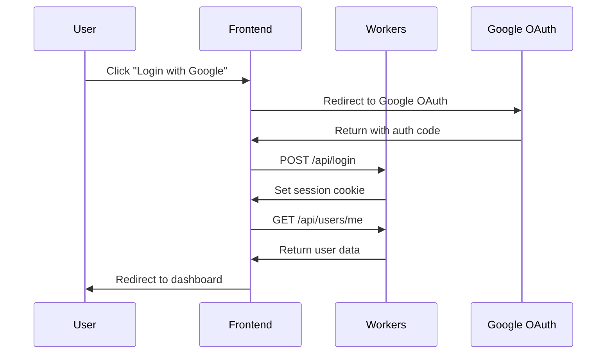
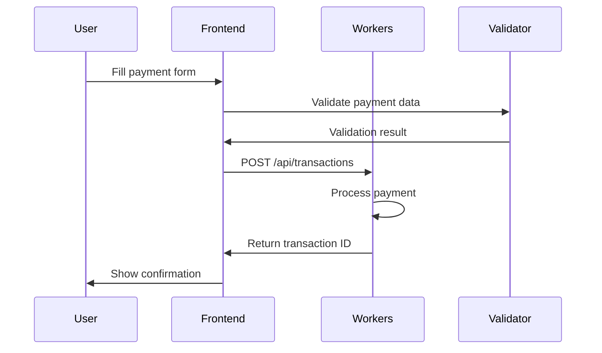
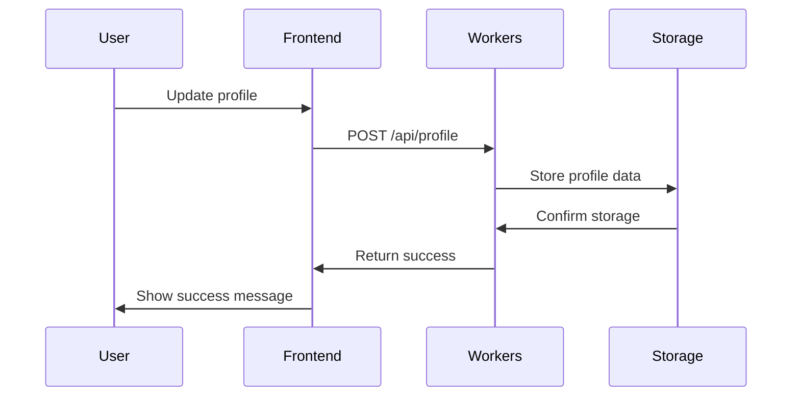
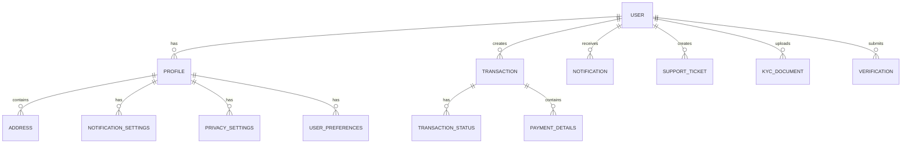

# SecurePay Architecture Documentation

## Overview

SecurePay is a modern, scalable international payments platform built with a microservices-inspired architecture using React frontend and Cloudflare Workers backend. The system is designed for high availability, security, and compliance with international banking standards.

## 🏗️ System Architecture

### High-Level Architecture

```
┌─────────────────┐    ┌─────────────────┐    ┌─────────────────┐
│   Frontend      │    │   CDN/Edge      │    │   Backend       │
│   (React SPA)   │◄──►│   (Cloudflare)  │◄──►│   (Workers)     │
└─────────────────┘    └─────────────────┘    └─────────────────┘
         │                       │                       │
         │                       │                       │
         ▼                       ▼                       ▼
┌─────────────────┐    ┌─────────────────┐    ┌─────────────────┐
│   Browser       │    │   Edge Cache    │    │   API Gateway   │
│   Storage       │    │   & Security    │    │   & Routing     │
└─────────────────┘    └─────────────────┘    └─────────────────┘
```

### Technology Stack

#### Frontend
- **Framework**: React 19 with TypeScript
- **Build Tool**: Vite 6
- **Styling**: Tailwind CSS
- **State Management**: React Context API
- **Routing**: React Router 7
- **Internationalization**: i18next
- **Validation**: Zod

#### Backend
- **Platform**: Cloudflare Workers
- **Framework**: Hono
- **Language**: TypeScript
- **Validation**: Zod
- **Authentication**: Session-based with cookies

#### Infrastructure
- **CDN**: Cloudflare CDN
- **Edge Computing**: Cloudflare Workers
- **Security**: Cloudflare Security Suite
- **Monitoring**: Cloudflare Analytics

## 📁 Project Structure

```
securepay-app/
├── src/
│   ├── components/          # Reusable UI components
│   │   ├── Layout.tsx      # Main layout wrapper
│   │   ├── Dialog.tsx      # Modal dialogs
│   │   ├── FormField.tsx   # Form input components
│   │   ├── LoadingSpinner.tsx # Loading indicators
│   │   ├── ErrorBoundary.tsx # Error handling
│   │   ├── NotificationCenter.tsx # Notification system
│   │   ├── LiveChat.tsx    # Live chat component
│   │   ├── SupportTickets.tsx # Support ticket system
│   │   ├── FAQ.tsx         # FAQ component
│   │   └── ComplianceCenter.tsx # Compliance features
│   ├── contexts/           # React contexts
│   │   ├── AuthContext.tsx # Authentication state
│   │   └── ThemeContext.tsx # Theme management
│   ├── pages/              # Page components
│   │   ├── Landing.tsx     # Landing page
│   │   ├── Login.tsx       # Login page
│   │   ├── Register.tsx    # Registration page
│   │   ├── Dashboard.tsx   # Main dashboard
│   │   ├── Profile.tsx     # User profile
│   │   ├── PaymentForm.tsx # Payment processing
│   │   ├── AuthCallback.tsx # OAuth callback
│   │   ├── Privacy.tsx     # Privacy policy
│   │   ├── Terms.tsx       # Terms of service
│   │   ├── Contact.tsx     # Contact page
│   │   └── ForgotPassword.tsx # Password recovery
│   ├── shared/             # Shared utilities
│   │   └── types.ts        # TypeScript definitions
│   ├── worker/             # Cloudflare Workers backend
│   │   └── index.ts        # API endpoints
│   ├── i18n.ts             # Internationalization
│   ├── main.tsx            # Application entry point
│   └── App.tsx             # Root component
├── public/                 # Static assets
├── migrations/             # Database migrations
├── docs/                   # Documentation
├── tests/                  # Test files
├── package.json            # Dependencies and scripts
├── vite.config.ts          # Vite configuration
├── tailwind.config.js      # Tailwind CSS configuration
├── tsconfig.json           # TypeScript configuration
├── wrangler.toml           # Cloudflare Workers configuration
└── README.md               # Project documentation
```

## 🔄 Data Flow

### Authentication Flow



### Payment Processing Flow



### Profile Management Flow



## 🔐 Security Architecture

### Authentication & Authorization

#### Session Management
```typescript
// Session token structure
interface SessionToken {
  userId: string;
  email: string;
  issuedAt: number;
  expiresAt: number;
  permissions: string[];
}

// Session validation
const validateSession = async (token: string): Promise<User | null> => {
  try {
    const decoded = jwt.verify(token, SECRET_KEY) as SessionToken;
    if (decoded.expiresAt < Date.now()) {
      return null; // Token expired
    }
    return await getUserById(decoded.userId);
  } catch {
    return null; // Invalid token
  }
};
```

#### Authorization Levels
```typescript
enum Permission {
  READ_PROFILE = 'read:profile',
  WRITE_PROFILE = 'write:profile',
  CREATE_PAYMENT = 'create:payment',
  READ_TRANSACTIONS = 'read:transactions',
  ADMIN_USERS = 'admin:users'
}

// Role-based access control
const checkPermission = (user: User, permission: Permission): boolean => {
  return user.permissions.includes(permission);
};
```

### Data Protection

#### Encryption
```typescript
// Data encryption at rest
const encryptSensitiveData = (data: string): string => {
  const algorithm = 'aes-256-gcm';
  const key = crypto.scryptSync(ENCRYPTION_KEY, 'salt', 32);
  const iv = crypto.randomBytes(16);
  const cipher = crypto.createCipher(algorithm, key);
  cipher.setAAD(Buffer.from('additional-data'));
  
  let encrypted = cipher.update(data, 'utf8', 'hex');
  encrypted += cipher.final('hex');
  
  const authTag = cipher.getAuthTag();
  
  return `${iv.toString('hex')}:${authTag.toString('hex')}:${encrypted}`;
};
```

#### Input Validation
```typescript
// Comprehensive input validation
const PaymentSchema = z.object({
  amount: z.number()
    .positive('Amount must be positive')
    .max(50000, 'Amount exceeds maximum limit'),
  currency: z.enum(['USD', 'EUR', 'ZAR', 'GBP', 'JPY']),
  recipientAccount: z.string()
    .regex(/^[0-9]{8,12}$/, 'Invalid account number format'),
  swiftCode: z.string()
    .regex(/^[A-Z]{6}[A-Z0-9]{2}([A-Z0-9]{3})?$/, 'Invalid SWIFT code'),
  reference: z.string().optional()
});
```

### Security Headers

```typescript
// Security middleware
app.use('*', async (c, next) => {
  // Content Security Policy
  c.header('Content-Security-Policy', 
    "default-src 'self'; script-src 'self' 'unsafe-inline'; style-src 'self' 'unsafe-inline'");
  
  // XSS Protection
  c.header('X-XSS-Protection', '1; mode=block');
  
  // Clickjacking Protection
  c.header('X-Frame-Options', 'DENY');
  
  // MIME Type Sniffing Protection
  c.header('X-Content-Type-Options', 'nosniff');
  
  // Referrer Policy
  c.header('Referrer-Policy', 'strict-origin-when-cross-origin');
  
  // HSTS
  c.header('Strict-Transport-Security', 'max-age=31536000; includeSubDomains');
  
  await next();
});
```

## 🌐 API Architecture

### RESTful API Design

#### Endpoint Structure
```
/api
├── /auth
│   ├── POST /login
│   ├── GET /logout
│   └── GET /users/me
├── /profile
│   ├── GET /profile
│   ├── POST /profile
│   ├── POST /profile/delete
│   ├── POST /profile/verify-phone
│   └── POST /profile/kyc-upload
├── /transactions
│   ├── GET /transactions
│   └── POST /transactions
├── /account
│   └── GET /account/balance
├── /analytics
│   └── GET /transactions/analytics
├── /notifications
│   ├── GET /notifications
│   ├── POST /notifications/:id/read
│   ├── POST /notifications/:id/archive
│   └── POST /notifications/settings
├── /support
│   ├── GET /support/tickets
│   ├── POST /support/tickets
│   └── POST /support/tickets/:id/messages
├── /compliance
│   ├── POST /verification/identity
│   ├── GET /verification/status
│   ├── GET /risk/assessment
│   └── GET /compliance/reports
└── /legal
    ├── POST /legal/terms/accept
    ├── GET /legal/terms/status
    ├── POST /legal/privacy/consent
    └── GET /legal/privacy/consents
```

#### Response Format
```typescript
// Standard API response format
interface ApiResponse<T> {
  success: boolean;
  data?: T;
  error?: string;
  message?: string;
  timestamp: string;
  requestId: string;
}

// Error response format
interface ApiError {
  success: false;
  error: string;
  code: string;
  details?: Record<string, any>;
  timestamp: string;
  requestId: string;
}
```

### Middleware Architecture

```typescript
// Middleware chain
app.use('*', corsMiddleware);
app.use('*', securityHeadersMiddleware);
app.use('*', requestLoggingMiddleware);
app.use('*', rateLimitingMiddleware);

// Protected routes
app.use('/api/*', authenticationMiddleware);
app.use('/api/admin/*', adminAuthorizationMiddleware);
app.use('/api/payments/*', paymentValidationMiddleware);
```

## 🗄️ Data Architecture

### Data Models

#### User Profile
```typescript
interface UserProfile {
  id: number;
  userId: string;
  fullName: string;
  idNumber: string;
  accountNumber: string;
  username: string;
  profilePicture?: string;
  phoneNumber?: string;
  phoneVerified: boolean;
  dateOfBirth?: string;
  gender?: 'male' | 'female' | 'other' | 'prefer_not_to_say';
  address?: Address;
  kycDocuments: KYCDocument[];
  accountVerificationStatus: 'unverified' | 'pending' | 'verified' | 'rejected';
  notificationSettings: NotificationSettings;
  privacySettings: PrivacySettings;
  userPreferences: UserPreferences;
  isVerified: boolean;
  createdAt: string;
  updatedAt: string;
  lastLogin: string;
  accountStatus: 'active' | 'suspended' | 'deleted';
  deletionRequestedAt?: string;
}
```

#### Transaction
```typescript
interface Transaction {
  id: number;
  userId: string;
  transactionId: string;
  amount: number;
  currency: string;
  recipientAccount: string;
  swiftCode: string;
  status: 'Pending' | 'Verified' | 'Sent' | 'Failed';
  reference?: string;
  createdAt: string;
  updatedAt: string;
}
```

#### Notification
```typescript
interface Notification {
  id: string;
  userId: string;
  type: 'email' | 'sms' | 'push' | 'in_app';
  title: string;
  message: string;
  priority: 'low' | 'medium' | 'high' | 'urgent';
  status: 'unread' | 'read' | 'archived';
  category: 'transaction' | 'security' | 'account' | 'system' | 'marketing';
  data?: Record<string, any>;
  createdAt: string;
  readAt?: string;
  sentAt?: string;
}
```

### Data Relationships



## 🔄 State Management

### Frontend State Architecture

#### Context Providers
```typescript
// Application state hierarchy
<ErrorBoundary>
  <ThemeProvider>
    <AuthProvider>
      <Router>
        <App />
      </Router>
    </AuthProvider>
  </ThemeProvider>
</ErrorBoundary>
```

#### State Flow
```typescript
// State management pattern
interface AppState {
  auth: AuthState;
  theme: ThemeState;
  profile: ProfileState;
  payments: PaymentState;
  notifications: NotificationState;
}

// State updates flow
User Action → Component → Context → State Update → UI Re-render
```

### Backend State Management

#### Session State
```typescript
// Session storage in Cloudflare Workers
interface SessionStore {
  [sessionId: string]: {
    user: User;
    permissions: string[];
    lastActivity: number;
    expiresAt: number;
  };
}

// Session management
class SessionManager {
  async createSession(user: User): Promise<string> {
    const sessionId = generateSessionId();
    const session = {
      user,
      permissions: user.permissions,
      lastActivity: Date.now(),
      expiresAt: Date.now() + SESSION_DURATION
    };
    
    await SESSIONS.put(sessionId, JSON.stringify(session), {
      expirationTtl: SESSION_DURATION / 1000
    });
    
    return sessionId;
  }
}
```

## 🚀 Performance Architecture

### Frontend Performance

#### Code Splitting
```typescript
// Lazy loading for routes
const Dashboard = lazy(() => import('./pages/Dashboard'));
const Profile = lazy(() => import('./pages/Profile'));
const PaymentForm = lazy(() => import('./pages/PaymentForm'));

// Component-level code splitting
const NotificationCenter = lazy(() => import('./components/NotificationCenter'));
const LiveChat = lazy(() => import('./components/LiveChat'));
```

#### Caching Strategy
```typescript
// Service worker for caching
const CACHE_STRATEGIES = {
  STATIC: 'cache-first',
  API: 'network-first',
  IMAGES: 'stale-while-revalidate'
};

// Cache configuration
const CACHE_CONFIG = {
  STATIC_ASSETS: {
    maxAge: 31536000, // 1 year
    maxEntries: 100
  },
  API_RESPONSES: {
    maxAge: 300, // 5 minutes
    maxEntries: 50
  }
};
```

### Backend Performance

#### Edge Computing
```typescript
// Cloudflare Workers performance optimizations
export default {
  async fetch(request: Request, env: Env, ctx: ExecutionContext) {
    // Parallel processing
    const [userData, profileData, balanceData] = await Promise.all([
      getUserData(request),
      getProfileData(request),
      getBalanceData(request)
    ]);
    
    // Streaming responses
    const stream = new ReadableStream({
      start(controller) {
        controller.enqueue(JSON.stringify({ user: userData }));
        controller.enqueue(JSON.stringify({ profile: profileData }));
        controller.close();
      }
    });
    
    return new Response(stream, {
      headers: { 'Content-Type': 'application/json' }
    });
  }
};
```

#### Caching Strategy
```typescript
// Multi-level caching
const CACHE_LEVELS = {
  L1: 'memory', // In-memory cache
  L2: 'kv',     // Cloudflare KV
  L3: 'cdn'     // CDN cache
};

// Cache invalidation
const invalidateCache = async (key: string) => {
  await MEMORY_CACHE.delete(key);
  await KV_CACHE.delete(key);
  await CDN_CACHE.purge(key);
};
```

## 🔍 Monitoring & Observability

### Logging Architecture

#### Structured Logging
```typescript
// Log levels and structure
enum LogLevel {
  DEBUG = 'debug',
  INFO = 'info',
  WARN = 'warn',
  ERROR = 'error'
}

interface LogEntry {
  level: LogLevel;
  message: string;
  timestamp: string;
  requestId: string;
  userId?: string;
  action?: string;
  metadata?: Record<string, any>;
}

// Logging middleware
const loggingMiddleware = async (c: Context, next: Next) => {
  const startTime = Date.now();
  const requestId = generateRequestId();
  
  c.set('requestId', requestId);
  
  try {
    await next();
    
    log.info('Request completed', {
      requestId,
      method: c.req.method,
      path: c.req.path,
      status: c.res.status,
      duration: Date.now() - startTime
    });
  } catch (error) {
    log.error('Request failed', {
      requestId,
      method: c.req.method,
      path: c.req.path,
      error: error.message,
      stack: error.stack
    });
    throw error;
  }
};
```

### Metrics Collection

#### Performance Metrics
```typescript
// Key performance indicators
interface PerformanceMetrics {
  responseTime: number;
  throughput: number;
  errorRate: number;
  availability: number;
  userSatisfaction: number;
}

// Metrics collection
const collectMetrics = async (request: Request, response: Response) => {
  const metrics = {
    responseTime: Date.now() - request.startTime,
    statusCode: response.status,
    userAgent: request.headers.get('user-agent'),
    timestamp: new Date().toISOString()
  };
  
  await METRICS.put(`metric:${Date.now()}`, JSON.stringify(metrics));
};
```

### Error Handling

#### Error Boundaries
```typescript
// React error boundary
class ErrorBoundary extends Component<Props, State> {
  constructor(props: Props) {
    super(props);
    this.state = { hasError: false, error: null };
  }
  
  static getDerivedStateFromError(error: Error): State {
    return { hasError: true, error };
  }
  
  componentDidCatch(error: Error, errorInfo: ErrorInfo) {
    log.error('Component error', {
      error: error.message,
      stack: error.stack,
      componentStack: errorInfo.componentStack
    });
  }
  
  render() {
    if (this.state.hasError) {
      return <ErrorFallback error={this.state.error} />;
    }
    
    return this.props.children;
  }
}
```

#### API Error Handling
```typescript
// Centralized error handling
class ApiError extends Error {
  constructor(
    message: string,
    public statusCode: number,
    public code: string,
    public details?: Record<string, any>
  ) {
    super(message);
    this.name = 'ApiError';
  }
}

// Error handling middleware
const errorHandler = async (c: Context, next: Next) => {
  try {
    await next();
  } catch (error) {
    if (error instanceof ApiError) {
      return c.json({
        success: false,
        error: error.message,
        code: error.code,
        details: error.details
      }, error.statusCode);
    }
    
    // Log unexpected errors
    log.error('Unexpected error', {
      error: error.message,
      stack: error.stack,
      requestId: c.get('requestId')
    });
    
    return c.json({
      success: false,
      error: 'Internal server error',
      code: 'INTERNAL_ERROR'
    }, 500);
  }
};
```

## 🔄 Deployment Architecture

### CI/CD Pipeline

```yaml
# GitHub Actions workflow
name: Deploy SecurePay

on:
  push:
    branches: [main, develop]
  pull_request:
    branches: [main]

jobs:
  test:
    runs-on: ubuntu-latest
    steps:
      - uses: actions/checkout@v3
      - uses: actions/setup-node@v3
        with:
          node-version: '18'
      - run: npm ci
      - run: npm run lint
      - run: npm run test
      - run: npm run build

  deploy-staging:
    needs: test
    if: github.ref == 'refs/heads/develop'
    runs-on: ubuntu-latest
    steps:
      - uses: actions/checkout@v3
      - uses: actions/setup-node@v3
      - run: npm ci
      - run: npm run build
      - uses: cloudflare/wrangler-action@v3
        with:
          apiToken: ${{ secrets.CLOUDFLARE_API_TOKEN }}
          accountId: ${{ secrets.CLOUDFLARE_ACCOUNT_ID }}
          command: deploy --env staging

  deploy-production:
    needs: test
    if: github.ref == 'refs/heads/main'
    runs-on: ubuntu-latest
    steps:
      - uses: actions/checkout@v3
      - uses: actions/setup-node@v3
      - run: npm ci
      - run: npm run build
      - uses: cloudflare/wrangler-action@v3
        with:
          apiToken: ${{ secrets.CLOUDFLARE_API_TOKEN }}
          accountId: ${{ secrets.CLOUDFLARE_ACCOUNT_ID }}
          command: deploy --env production
```

### Environment Configuration

#### Environment Variables
```bash
# Development
VITE_API_URL=http://localhost:8787
VITE_ENVIRONMENT=development
VITE_DEBUG=true

# Staging
VITE_API_URL=https://staging-api.securepay.com
VITE_ENVIRONMENT=staging
VITE_DEBUG=false

# Production
VITE_API_URL=https://api.securepay.com
VITE_ENVIRONMENT=production
VITE_DEBUG=false
```

#### Cloudflare Workers Configuration
```toml
# wrangler.toml
name = "securepay-api"
main = "src/worker/index.ts"
compatibility_date = "2024-01-01"

[env.development]
name = "securepay-api-dev"
vars = { ENVIRONMENT = "development" }

[env.staging]
name = "securepay-api-staging"
vars = { ENVIRONMENT = "staging" }

[env.production]
name = "securepay-api-prod"
vars = { ENVIRONMENT = "production" }

[[kv_namespaces]]
binding = "SESSIONS"
id = "session-storage-id"
preview_id = "session-storage-preview-id"

[[kv_namespaces]]
binding = "METRICS"
id = "metrics-storage-id"
preview_id = "metrics-storage-preview-id"
```

## 🔒 Compliance Architecture

### KYC/AML Compliance

#### Document Verification
```typescript
// Document verification workflow
interface DocumentVerification {
  id: string;
  userId: string;
  documentType: 'passport' | 'national_id' | 'drivers_license';
  documentNumber: string;
  documentFrontUrl: string;
  documentBackUrl?: string;
  selfieUrl: string;
  status: 'pending' | 'approved' | 'rejected';
  verifiedAt?: string;
  rejectedReason?: string;
  createdAt: string;
  updatedAt: string;
}

// Verification process
const verifyDocument = async (verification: DocumentVerification) => {
  // 1. OCR extraction
  const extractedData = await extractDocumentData(verification.documentFrontUrl);
  
  // 2. Face comparison
  const faceMatch = await compareFaces(
    verification.documentFrontUrl,
    verification.selfieUrl
  );
  
  // 3. Database checks
  const databaseChecks = await performDatabaseChecks(extractedData);
  
  // 4. Risk assessment
  const riskScore = await calculateRiskScore(verification);
  
  return {
    approved: faceMatch && databaseChecks.passed && riskScore < 70,
    riskScore,
    details: { faceMatch, databaseChecks, riskScore }
  };
};
```

#### Risk Assessment
```typescript
// Risk assessment model
interface RiskAssessment {
  id: string;
  userId: string;
  riskScore: number;
  riskLevel: 'low' | 'medium' | 'high';
  factors: string[];
  assessmentDate: string;
  nextReviewDate: string;
}

// Risk calculation
const calculateRiskScore = async (user: User): Promise<number> => {
  let score = 0;
  
  // Document verification
  if (user.kycDocuments.every(doc => doc.verified)) {
    score -= 20;
  } else {
    score += 30;
  }
  
  // Transaction patterns
  const transactionPattern = await analyzeTransactionPattern(user.id);
  score += transactionPattern.riskScore;
  
  // Geographic risk
  const geoRisk = await calculateGeographicRisk(user.address?.country);
  score += geoRisk;
  
  // Account age
  const accountAge = Date.now() - new Date(user.createdAt).getTime();
  if (accountAge > 365 * 24 * 60 * 60 * 1000) { // 1 year
    score -= 10;
  }
  
  return Math.max(0, Math.min(100, score));
};
```

### Data Privacy

#### GDPR Compliance
```typescript
// Data processing consent
interface PrivacyConsent {
  id: string;
  userId: string;
  consentType: 'marketing' | 'analytics' | 'essential' | 'third_party';
  granted: boolean;
  grantedAt?: string;
  revokedAt?: string;
  ipAddress: string;
  userAgent: string;
}

// Data export functionality
const exportUserData = async (userId: string, exportType: 'profile' | 'transactions' | 'all') => {
  const userData = await getUserData(userId);
  
  let exportData: any = {};
  
  if (exportType === 'profile' || exportType === 'all') {
    exportData.profile = userData.profile;
    exportData.preferences = userData.preferences;
  }
  
  if (exportType === 'transactions' || exportType === 'all') {
    exportData.transactions = await getUserTransactions(userId);
  }
  
  return {
    userId,
    exportType,
    data: exportData,
    exportedAt: new Date().toISOString(),
    format: 'json'
  };
};
```

## 🔄 Scalability Architecture

### Horizontal Scaling

#### Load Balancing
```typescript
// Cloudflare Workers automatically handle load balancing
// Multiple instances run across the global edge network

// Rate limiting per user
const rateLimiter = new Map<string, { count: number; resetTime: number }>();

const checkRateLimit = (userId: string, limit: number, window: number): boolean => {
  const now = Date.now();
  const userLimit = rateLimiter.get(userId);
  
  if (!userLimit || now > userLimit.resetTime) {
    rateLimiter.set(userId, { count: 1, resetTime: now + window });
    return true;
  }
  
  if (userLimit.count >= limit) {
    return false;
  }
  
  userLimit.count++;
  return true;
};
```

#### Caching Strategy
```typescript
// Multi-level caching
const CACHE_STRATEGIES = {
  USER_PROFILE: {
    ttl: 300, // 5 minutes
    strategy: 'stale-while-revalidate'
  },
  TRANSACTION_HISTORY: {
    ttl: 60, // 1 minute
    strategy: 'network-first'
  },
  STATIC_CONTENT: {
    ttl: 86400, // 24 hours
    strategy: 'cache-first'
  }
};

// Cache implementation
const getCachedData = async (key: string, strategy: CacheStrategy) => {
  const cached = await caches.default.match(key);
  
  if (strategy === 'cache-first' && cached) {
    return cached;
  }
  
  const fresh = await fetchData(key);
  
  if (strategy === 'stale-while-revalidate' && cached) {
    // Return cached data immediately, update in background
    caches.default.put(key, fresh.clone());
    return cached;
  }
  
  // Cache fresh data
  caches.default.put(key, fresh.clone());
  return fresh;
};
```

### Database Scaling

#### Data Partitioning
```typescript
// User data partitioning by region
const getUserPartition = (userId: string): string => {
  const hash = createHash('md5').update(userId).digest('hex');
  const partition = parseInt(hash.substring(0, 8), 16) % 100;
  return `partition_${partition}`;
};

// Transaction data partitioning by date
const getTransactionPartition = (date: Date): string => {
  const year = date.getFullYear();
  const month = date.getMonth() + 1;
  return `transactions_${year}_${month.toString().padStart(2, '0')}`;
};
```

## 🔮 Future Architecture

### Planned Improvements

#### Microservices Migration
```typescript
// Future microservices architecture
interface MicroserviceConfig {
  name: string;
  domain: string;
  endpoints: string[];
  dependencies: string[];
  scaling: {
    minInstances: number;
    maxInstances: number;
    autoScaling: boolean;
  };
}

const MICROSERVICES = [
  {
    name: 'user-service',
    domain: 'users.securepay.com',
    endpoints: ['/api/users', '/api/profile'],
    dependencies: ['auth-service'],
    scaling: { minInstances: 2, maxInstances: 10, autoScaling: true }
  },
  {
    name: 'payment-service',
    domain: 'payments.securepay.com',
    endpoints: ['/api/transactions', '/api/payments'],
    dependencies: ['user-service', 'compliance-service'],
    scaling: { minInstances: 3, maxInstances: 15, autoScaling: true }
  }
];
```

#### Event-Driven Architecture
```typescript
// Event-driven communication
interface Event {
  id: string;
  type: string;
  source: string;
  data: any;
  timestamp: string;
  version: string;
}

const EVENT_TYPES = {
  USER_REGISTERED: 'user.registered',
  PAYMENT_CREATED: 'payment.created',
  PAYMENT_COMPLETED: 'payment.completed',
  DOCUMENT_VERIFIED: 'document.verified',
  NOTIFICATION_SENT: 'notification.sent'
};

// Event handlers
const eventHandlers = {
  [EVENT_TYPES.USER_REGISTERED]: async (event: Event) => {
    await sendWelcomeEmail(event.data.userId);
    await createUserProfile(event.data.userId);
  },
  
  [EVENT_TYPES.PAYMENT_CREATED]: async (event: Event) => {
    await updateUserBalance(event.data.userId, event.data.amount);
    await sendPaymentConfirmation(event.data.userId);
  }
};
```

---

This architecture documentation provides a comprehensive overview of the SecurePay system design, implementation details, and future roadmap. For more specific technical details, refer to the individual component documentation and API reference. 